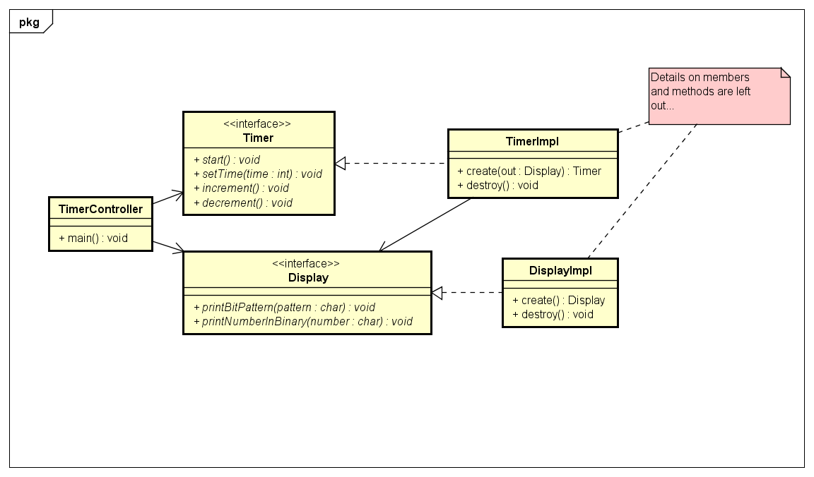

# C Programming - Exercises Session 03

## Program Structure and Abstract Data Types

1. Implement your timer from "Exercises Session 01" using abstract data types. The timer and output to led's should each be concealed in abstract data types. See diagram below.
    
    Since we don't know how to use the build in hardware timers in the AVR, the timer should just implement a busy waiting loop in the `start()` method. Therefore it should not be possible to change the time while the timer is running. Stop and reset functions have also been omitted.

    

